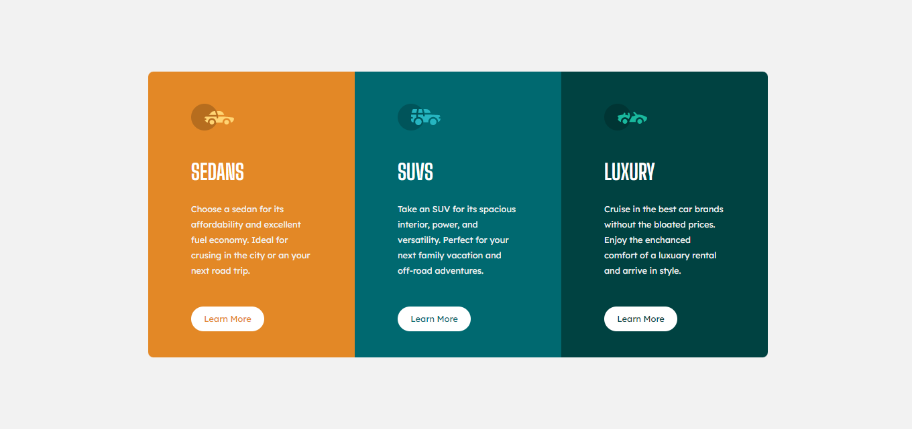
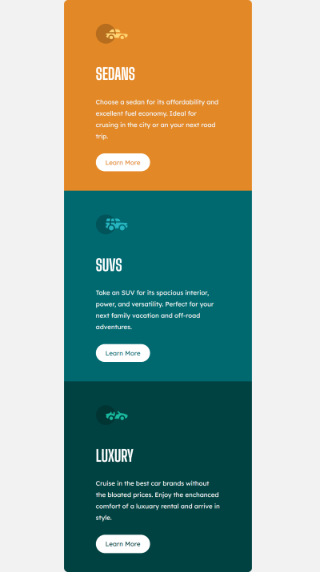

# 3-column preview component
 
## Table of Content

 * [Overview of the Project](#overview-of-the-project)
      * [Goal of the project](#goal-of-the-project)
      * [Screenshot](#screenshot)
 * [Technologies I Used](#technologies-i-used)
 * [What I Learned](#what-i-learned) 
 * [Acknowledgment](#acknowledgment)

# Overview of the Project
Its a 3-column preview card component challenge by Frontend mentor built with basic semantic HTML5 and CSS.

### Goal of the Project
The goal is to learn the basics of semantic HTML5 and CSS and also very good project who has entered in the world of web development. Its a Frontend mentor challenge and its just the basic one so main focus is to make the 3-column preview card component look as close to the design provided by the them.

## Screenshot

### Solution

### Desktop Preview

### Mobile Preview

## Technologies I Used
* Semantic HTML5
* CSS

## What I Learned
* I learned the basics of HTML5 and CSS.
* How to apply the flex properties, units(ems and rems), margin, padding and different font properties.
* Learned about media queries to make it responsive with both desktop and mobile.

## Acknowledgment
My acknowledgements goes out to Frontend mentor to have a challenge which helped me improve my HTML and CSS skills. Also to people who provided solution to the challenge to      improve it.
